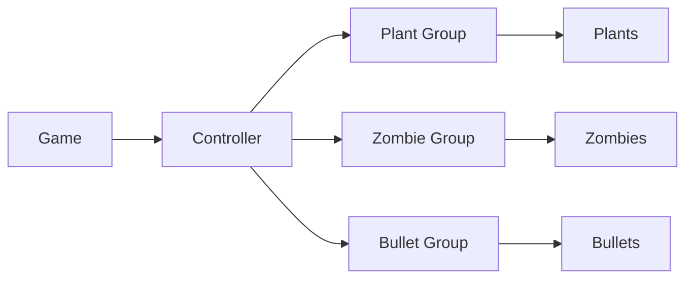

## 课程设计二 植物大战僵尸

**姓名：殷天润**

**学号：171240565**

#### 主要内容

###### 游戏环境

Linux 任何终端都可以; 需要开到最大的屏幕;

在提交ddl之后我在github上面进行了开源:

````
git clone https://github.com/larryytr/PVZ.git
````


如果要编译源码（可能运行./PVZ会 permission denied 我也不知道为什么），需要安装 cmake;然后:

````
cmake .
make
./PVZ
````

即可;

###### 游戏玩法:

- w,a,s,d 上下左右移动; 

  b 在商店购买商品 

  n 在空格种植植物

  j 铲掉这个格子的植物

  h 收获这个格子的太阳花的阳光

  Esc 可以直接重新开始

- 僵尸越过底线就判定为吃掉了脑子

- TIP:（如果不出现僵尸可以按Esc刷新一下，我在WSL和我的centos 服务器里面出现过这种情况，但是在ubuntu里面没有）

###### 植物图鉴:

- 向日葵:

  

  阳光：50

  生命值：50

  植物功能：生产阳光 用H收货

- 豌豆射手:

  

  阳光：100

  生命值：100

  植物功能：发射豌豆

- 寒冰射手:

  

  阳光：175

  生命值：100

  植物功能：发射冰豌豆 可以让僵尸减速

- 樱桃炸弹:

  

  阳光：150

  植物功能：对周围的僵尸造成200点伤害

- 坚果墙:

  

  阳光：50

  生命值：300

  植物功能：肉

###### 僵尸图鉴

- 普通僵尸：

  

  生命值：100

- 路障僵尸：

  

  生命值：200

  特点：在生命值<100的时候帽子会变成普通僵尸的样子

- 铁桶僵尸：

  

  生命值：300

  特点：在生命值<100的时候帽子会变成普通僵尸的样子

  

- 读报僵尸：

  

  生命值：200

  特点：在生命值<100的时候，手臂会变成普通僵尸的样子并且速度变快

###### 课程主要目标：

- 完成包含上述植物，僵尸的植物大战僵尸游戏，并且提供商店，铲子和积分功能
- 我额外做了开始和Restart界面，可以无限的玩游戏

###### 课程设计主要思路：

- （目前的思路）：



​	我的主要想法是: 

- 在Game里面控制游戏界面的切换:

  ````mermaid
  graph LR
  A[init]-->B[play]
  A-->C[exit]
  B-->D[failure]
  D-->C
  D-->B
  ````

- 在Game的play里面调用controller进行游戏逻辑游戏渲染，并且根据键盘的响应调用controller进行一些其他（比如：铲子，收货阳光）操作:

  ````mermaid
  graph LR
  A[play]-->B[键盘控制]
  A-->C[controller]
  B-->C
  C-->D[controller时间流逝]
  C-->E[僵尸生成]
  C-->F[僵尸/豌豆移动]
  C-->G[逻辑处理]
  C-->H[胜负判断]
  B-->I[移动控制]
  B-->J[商店购买]
  B-->L[收货阳光]
  B-->M[铲除植物]
  B-->N[重新开始]
  ````

- 对于渲染以及碰撞的处理，我的做法是对于bullet(豌豆),用 X,Y 存大格子的位置, 然后在根据植物本身的图案在生成的时候计算出 bx,by 这是具体的像素的位置，用来提供碰撞检测的数据；

- 对于每一个 bullet(豌豆) plant(植物) zombie(僵尸) plant(植物) 我的想法是在每一个对象里面都存好自身的位置(X,Y,bx,by),然后自己有一个根据位置的draw函数进行渲染,work函数进行每一个时间片自身的处理以及和其他对象的交互;具体的细节在下面的类介绍之中;

- PS:我之前失败的想法是用一个二维的map来存储数据，每一个时间片更新map的状态，然后对这个map进行统一的渲染，但是因为过于繁琐，不够解耦，遂放弃。

#### 主要类的设计

- 具体如下：

  

- 我自顶向下介绍各个类的设计;

- Game.h 中的game类:

  - int init()用来初始化屏幕，对w,s两个按键进行处理进行state的变换,根据state决定是play还是exit;
  - int play() 包含一个大的while循环来进行游戏,并且建立了一个controller对象c1,通过对按键事件的处理调用c1中的函数来进行游戏;
  - int failure() 显示最后得分以及并且通过对w,s的按键处理来完成state的变换,通过state决定是restart 还是 exit;
  - void test() 对上述三个函数进行了整合;

- logic.h下面的类:

  **controller类:**

  - private里面的一些常量：包括 sun 用来记录目前的阳光, t用来记录游戏进行的总时间片数,plant_catch用来存放在商店购买的植物种类,ID用来记录僵尸,植物,豌豆的ID, natual_sun_speed用来控制自然产生阳光的速度;

  - public中的变量:

  - 三个vector zombie_group,plant_group,bullet_group分别是三类对象的vector,对于后面的遍历，然后来进行对象的交互等操作；

    我觉得这里是一种**聚集**的思想

  - controller();生成函数 初始化一些内容

  - static void map_init(): 初始化地图 包括草地 商店等

  - void time_passing(): 使controller的t+1,并且调用三个vector里面所有对象的timepassing()函数;

  - void information_draw(); 用于基本信息 包括得分，阳光的绘图

  - void buy_plant(int x,int y) 根据上层提供的x,y修改plant_catch里面的内容来确定买了什么植物，如果阳光不够还会调用cannot_buy()函数在信息区告诉玩家阳光不够;

  - void plant_flowers(int x,int y) 根据上层提供的坐标以及plant_catch里面的type创建plant对象并且压入plant_group这个vector里面

  - void zombie_productor(int x,int y,int type)//在逻辑位x,y上面生产所需要的型号的僵尸

  - void plant_group_work(),void zomie_group_work(),void bullet_group_work();通过遍历上述的三个vector然后调用所有对象的work函数,有需要的还对其他的group进行的遍历,从而达成对象的交互(攻击);并且会把死亡的对象从vector里面删除，并且调用里面的death()函数进行渲染，达成对于草地的恢复；

    void both_work()调用了上面三个group_work();

  - void both_draw() ,void both_move()遍历所有对象 调用里面的draw()和 move()函数;

  - void sun_catch(int x,int y)根据给定的坐标 如果该坐标是向日葵 就收货里面的阳光

  - void delete_plant(int x,int y) 根据给定的坐标，让里面的植物死亡

  - void zombie_fram() 根据时间片改变烈度，根据烈度随机的调用zombie_productor(int x,int y,int type)来进行僵尸的产生；

  - int return score()返回分数

  **plant 类:**

  plant类拥有子类 peashooter , sunflower , nutwall, cherryzomb 

  peashooter 拥有子类 coldshooter

  这里主要用到了继承复用的OOP思想

  - protected 的 变量有：hp,name,speed,t,ID 分别是 生命值，名字，速度(1/speed) ,种植的时间(配合speed 用t%speed来完成速度),ID
  - public的变量有: x,y,type,bx,by 描述类型，坐标；Ready是提供给上层plant_group_work的 用于提示要不要进行一些工作比如制造豌豆等;alive表示存活与否,sun_catch表示向日葵生成并且存下来的阳光;
  - public的函数有：
  - plant 生成函数
  - 虚函数 virtual int work(class zombie &Z) 用于自身行为以及和zombie的交互的函数
  - 虚函数 virtual void draw() 不同的植物不同的绘图
  - void hurt(int attack_power)根据攻击力hp受到伤害
  - static void plant_show();商店中那些植物的渲染
  - void timepassing() 时间流逝更新t
  - 虚函数 virtual void death() ;植物alive==0之后对地图的恢复工作
  - bool check_location (int x,int y)用于上层定位植物的函数，反应植物在不在这个坐标的位置

  **plant的子类**

  主要进行了上述虚函数的一些重载工作；不再细述

  **zombie 类**

  zombie类拥有子类 Normal_zombie,Iron_zombie,Roadblock_zombie,Read_zombie;

  主要也是OOP的继承复用的思想

  具体的实现和plant里面的比较相像，除了多了一个freeze()函数来让僵尸的速度变慢;

  **bullet类**

  有子类cold_bullet类 具体实现也和上述的比较相像;

- Map.h里面主要是地图的一些定义，包括大格子的长宽，大格子的数量，地图的长宽

- ScreenDraw_linux.h 里面主要是一些绘图的函数，这个文件我参考了[博客](https://blog.csdn.net/kevinshq/article/details/8179252),并且询问了马常风同学

- Keyboard.h里面主要是对键盘事件的捕捉，我参考了[博客]( https://blog.csdn.net/WU9797/article/details/95195777)

#### 遇到的问题和解决方案

- 问题一：编译问题

  我在一开始的时候因为不太熟悉linux的多文件编译，特别的学了一下Makefile,但是还是只能写出脚本形式的Makefile,后来在机房询问了马常风同学，经过指点我发现了cmake这个好用的工具；

  在最开始的时候我也因为在.h里面声明全局变量以及交叉引用等导致了 "incomplement type"不完全形等错误，我选择了直接重开天地重写；

- 问题二：未初始化变量导致的浮点数异常

  我用在地图上打印特定颜色的方式层层寻找，终于定位了bug点，遂de之;

- 问题三：一些奇奇怪怪的死循环错误

  因为冤各有头债各有主，还是比较好找的(x)，重点是发现bug本身比较巧合，属于玩着玩着突然卡了才发现了这个bug

###### 致谢

感谢马常风同学对我的指点，感谢毛一鸣同学和我聊天以及思路的交流，他做出来之后的效果给我很大的界面上设计的启发，感谢黄秉焜同学日常的聊天和思路的交流


